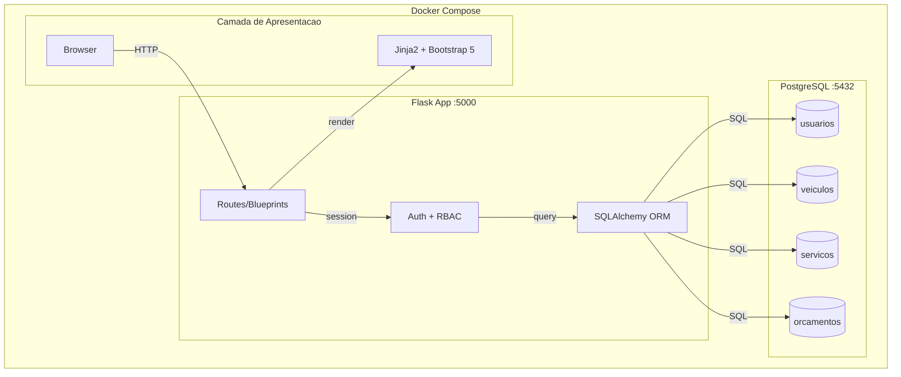

# Arquitetura do Sistema - Oficina Mecânica

## Stack Técnica

| Camada | Tecnologia |
|--------|------------|
| **Frontend** | Jinja2 + Bootstrap 5 |
| **Backend** | Flask 3.0 + SQLAlchemy 2.0 |
| **Database** | PostgreSQL 15 |
| **Auth** | Session-based + bcrypt |
| **Deploy** | Docker Compose |
| **Tests** | pytest (79% coverage) |

## Arquitetura

O sistema utiliza uma arquitetura monolítica em camadas com três componentes principais:

1. **Camada de Apresentação**: Templates Jinja2 renderizados server-side com Bootstrap 5 para interface responsiva
2. **Camada de Aplicação**: Flask com blueprints modularizados, autenticação baseada em sessões e controle de acesso RBAC via decorators
3. **Camada de Dados**: SQLAlchemy ORM mapeando 4 entidades principais no PostgreSQL

Todo o ambiente roda em containers Docker orquestrados pelo Docker Compose, garantindo isolamento e portabilidade.



## Estrutura do Projeto

```
tppe/
├── app/
│   ├── __init__.py          # Factory Pattern
│   ├── models.py            # SQLAlchemy Models
│   ├── routes/
│   │   ├── auth.py          # Login/Register
│   │   ├── views.py         # Frontend Routes
│   │   ├── usuarios.py      # API REST
│   │   ├── veiculos.py      # API REST
│   │   └── servicos.py      # API REST
│   ├── templates/           # Jinja2
│   └── static/              # CSS/JS
├── tests/
│   ├── conftest.py          # Fixtures
│   ├── test_auth.py         # Unit
│   ├── test_integration.py  # Integration
│   └── test_e2e.py          # Selenium
├── docker-compose.yml
└── requirements.txt
```

## Segurança

- **Autenticação**: Session-based com bcrypt hash
- **Autorização**: RBAC (cliente, mecanico, gerente)
- **Decorators**: `@login_required`, `@tipo_usuario_required`
- **Validações**: SQLAlchemy constraints, input sanitization

## Deploy

```bash
# Local
docker compose up

# Produção
docker build -t mecanica .
docker run -p 5000:5000 mecanica
```
