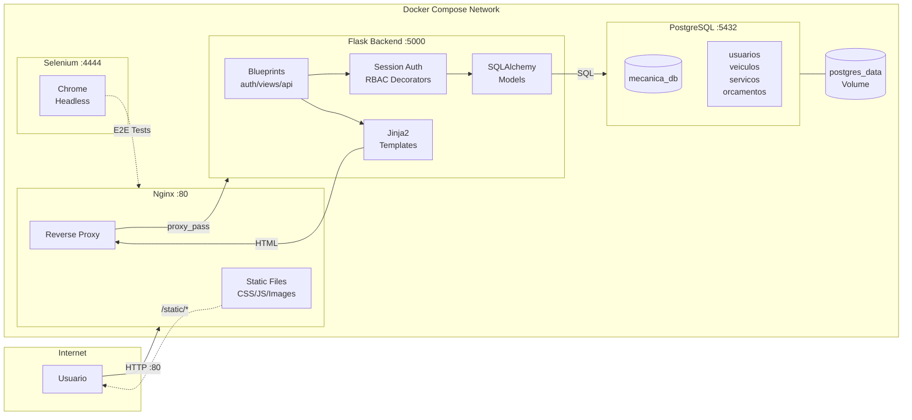

# Arquitetura do Sistema - Oficina Mecânica

## Stack Técnica

| Camada | Tecnologia |
|--------|------------|
| **Proxy/Static** | Nginx (porta 80) |
| **Frontend** | Jinja2 + Bootstrap 5 |
| **Backend** | Flask 3.0 + SQLAlchemy 2.0 |
| **Database** | PostgreSQL 15 Alpine |
| **Auth** | Session-based + bcrypt |
| **Tests** | pytest + Selenium |
| **Deploy** | Docker Compose |

## Arquitetura

O sistema utiliza uma arquitetura de **microserviços containerizados** com 4 containers Docker comunicando-se via rede interna:

1. **Nginx (frontend)**: Reverse proxy que serve arquivos estáticos (CSS/JS) e roteia requisições dinâmicas para o Flask
2. **Flask (backend)**: API e renderização de templates Jinja2, autenticação via sessões, RBAC com decorators
3. **PostgreSQL (db)**: Banco relacional com 4 tabelas principais e volume persistente
4. **Selenium (tests)**: Container para testes E2E automatizados com Chrome headless



## Fluxo de Requisição

```
1. Usuario acessa http://localhost:80
2. Nginx recebe requisição
   - Se /static/* → serve arquivo direto (cache 30d)
   - Senão → proxy_pass para Flask :5000
3. Flask processa:
   - Blueprint roteia para função correta
   - @login_required verifica sessão
   - @tipo_usuario_required verifica permissão
   - SQLAlchemy consulta PostgreSQL
   - Jinja2 renderiza template HTML
4. Resposta volta: Flask → Nginx → Usuario
```

## Estrutura do Projeto

```
tppe/
├── docker-compose.yml       # Orquestração dos 4 containers
├── backend/
│   ├── Dockerfile           # Imagem Python + Flask
│   ├── app/
│   │   ├── __init__.py      # Factory Pattern (create_app)
│   │   ├── models.py        # SQLAlchemy Models
│   │   ├── utils.py         # JWT + Decorators
│   │   └── routes/
│   │       ├── auth.py      # Login/Register/Logout
│   │       ├── views.py     # Rotas Web (templates)
│   │       ├── usuarios.py  # API REST
│   │       ├── veiculos.py  # API REST
│   │       └── servicos.py  # API REST
│   └── tests/               # pytest + selenium
├── frontend/
│   ├── Dockerfile           # Imagem Nginx
│   ├── nginx.conf           # Proxy + Static config
│   ├── templates/           # Jinja2 HTML
│   └── static/
│       ├── css/style.css    # Estilos customizados
│       └── js/main.js       # Scripts frontend
└── docs/                    # Documentação
```

## Containers Docker

| Container | Imagem | Porta | Função |
|-----------|--------|-------|--------|
| mecanica_frontend | nginx | 80 | Proxy reverso + static files |
| mecanica_backend | python:3.11 | 5000 (interno) | API Flask + Templates |
| mecanica_db | postgres:15-alpine | 5432 | Banco de dados |
| mecanica_selenium | selenium/chrome | 4444, 7900 | Testes E2E |

## Segurança

- **Autenticação**: Sessões Flask com cookie seguro
- **Senhas**: Hash bcrypt (não reversível)
- **RBAC**: 3 níveis (cliente, mecanico, gerente)
- **Decorators**: `@login_required`, `@tipo_usuario_required`
- **Nginx**: Headers de segurança, gzip, cache

## Deploy

```bash
# Subir todos os containers
docker compose up -d

# Ver logs
docker compose logs -f backend

# Acessar aplicação
http://localhost:80
```
