# Arquitetura do Sistema - Oficina Mecânica

## Visão Geral

| Aspecto | Tecnologia |
|---------|------------|
| **Padrão** | Monolito em Camadas (Layered Architecture) |
| **Framework** | Flask 3.0 + Jinja2 |
| **Banco de Dados** | PostgreSQL 15 |
| **ORM** | SQLAlchemy 2.0 |
| **Containerização** | Docker Compose |
| **Autenticação** | JWT + Sessões |

---

## Diagrama de Arquitetura Geral

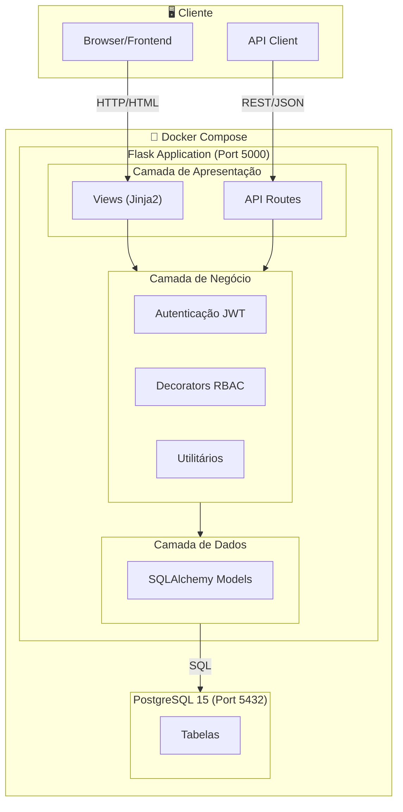

---

## Arquitetura em Camadas

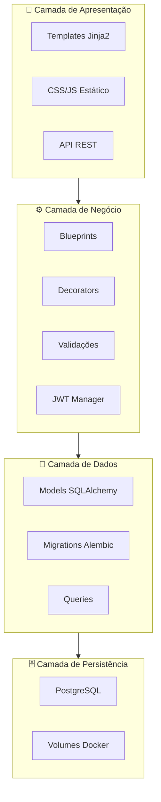

---

## Estrutura do Projeto

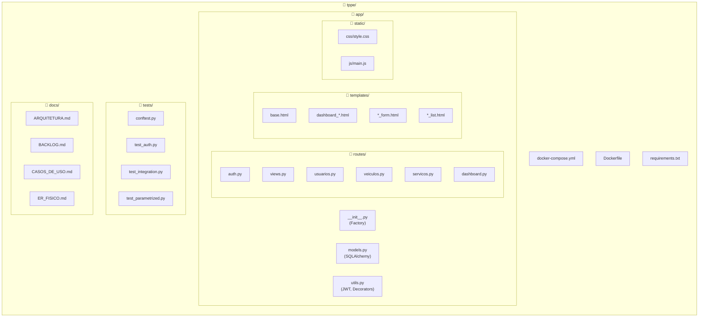

---

## Blueprints e Rotas

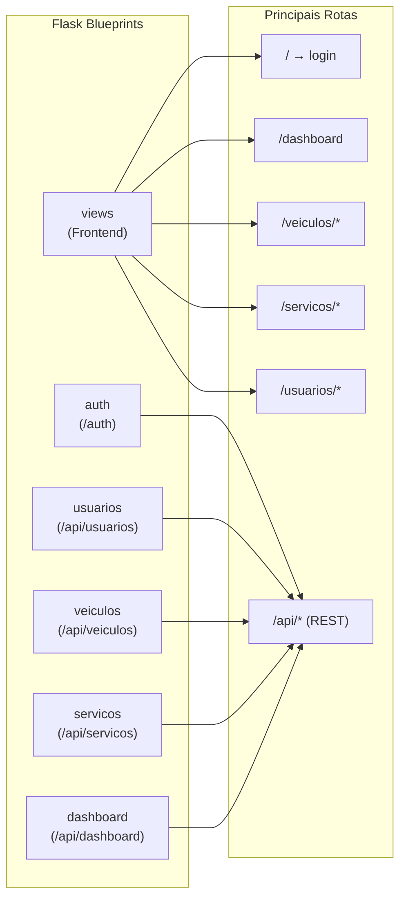

---

## Fluxo de Autenticação

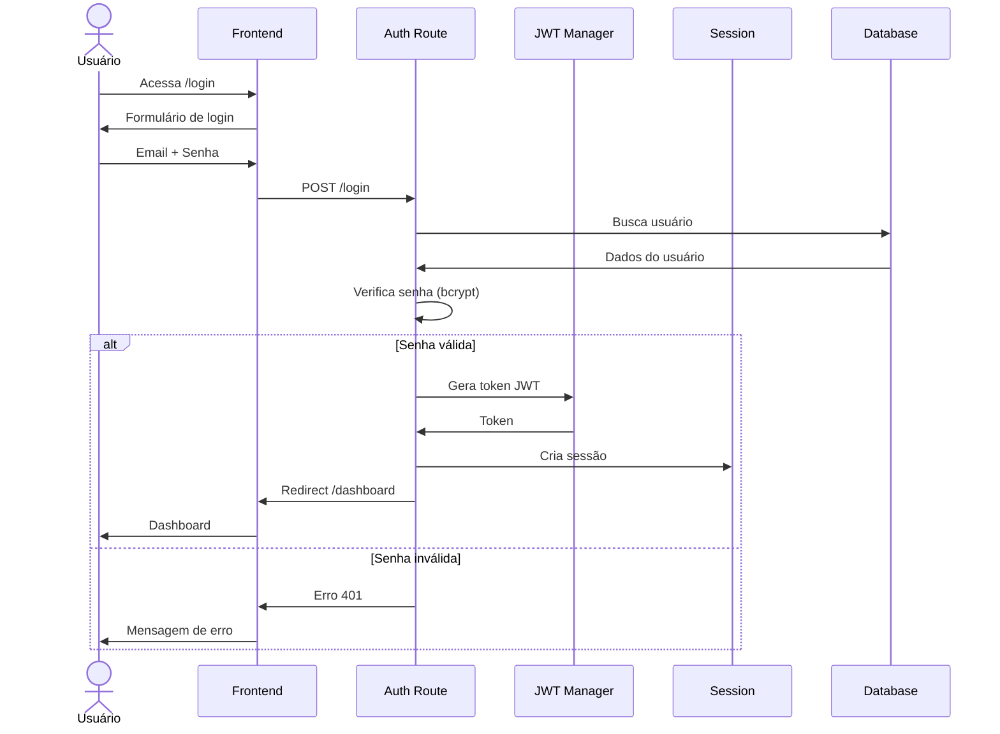

---

## Fluxo de Requisição API

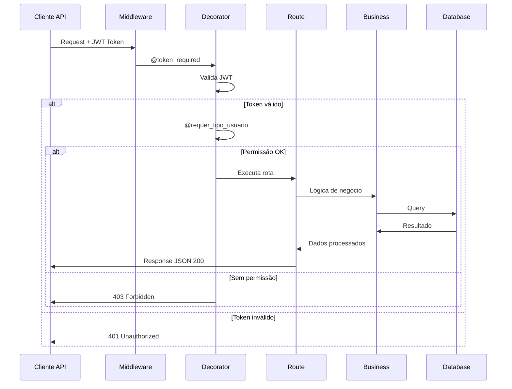

---

## Padrões de Design Utilizados

```mermaid
mindmap
  root((Padrões))
    Factory
      create_app()
      Configuração dinâmica
      Testes isolados
    Blueprint
      Modularização
      Separação de responsabilidades
      Prefixos de URL
    Decorator
      @token_required
      @requer_tipo_usuario
      @login_required
    Repository
      SQLAlchemy ORM
      Abstração de dados
      Queries reutilizáveis
    MVC
      Models - SQLAlchemy
      Views - Jinja2
      Controllers - Routes
```

---

## Modelo de Dados Resumido

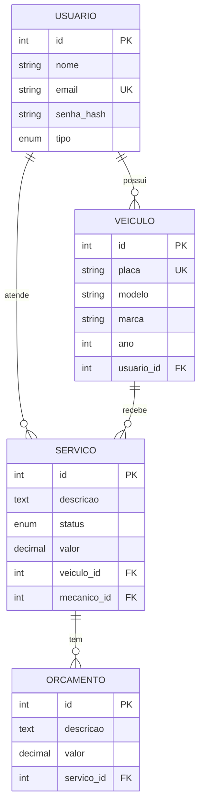

---

## Containerização Docker

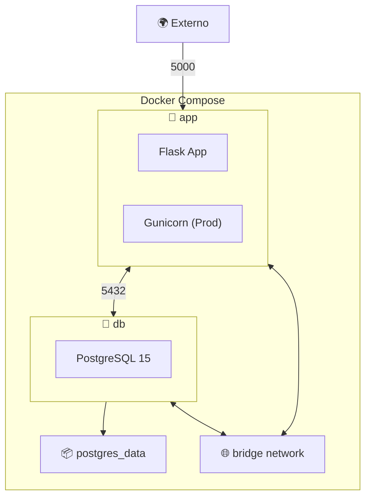

### docker-compose.yml

```yaml
version: '3.8'
services:
  app:
    build: .
    ports: ["5000:5000"]
    depends_on: [db]
    environment:
      - DATABASE_URL
      - SECRET_KEY

  db:
    image: postgres:15
    volumes: [postgres_data:/var/lib/postgresql/data]
    environment:
      - POSTGRES_DB
      - POSTGRES_USER
      - POSTGRES_PASSWORD
```

---

## Segurança

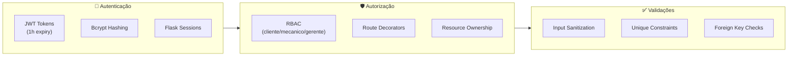

---

## Stack Técnica Completa

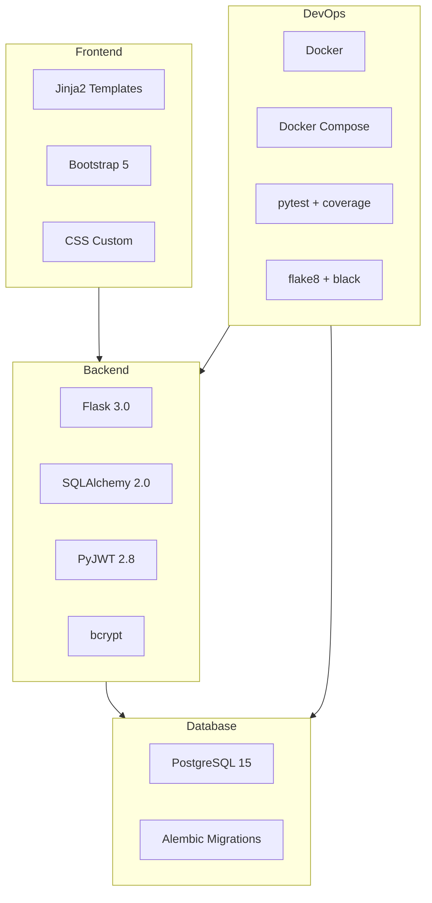

---

## Estratégia de Testes

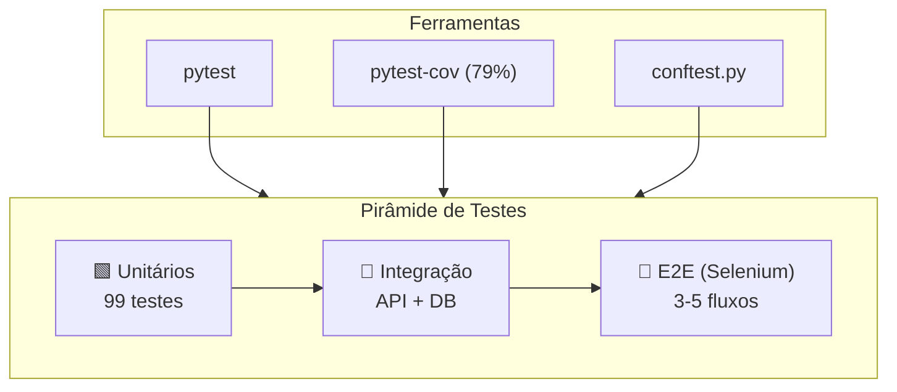

---

## Deploy

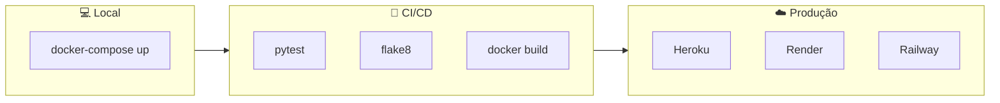

**Variáveis de Ambiente:**
- `DATABASE_URL` - Conexão PostgreSQL
- `SECRET_KEY` - Chave de sessão Flask
- `JWT_SECRET_KEY` - Chave para tokens JWT
