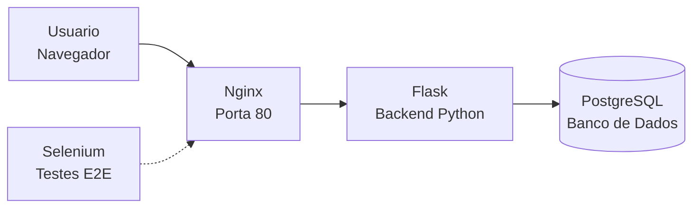

# Arquitetura do Sistema - Oficina Mecânica

## Tecnologias Utilizadas

| Componente | Tecnologia |
|------------|------------|
| **Servidor Web** | Nginx |
| **Backend** | Python + Flask |
| **Banco de Dados** | PostgreSQL |
| **Frontend** | HTML + Bootstrap 5 |
| **Testes** | Pytest + Selenium |
| **Containerizacao** | Docker Compose |

## Visao Geral

O sistema roda inteiramente em **Docker**, com 4 containers isolados que se comunicam em rede interna:



## Funcionamento

1. **Usuario** acessa o sistema pelo navegador na porta 80
2. **Nginx** recebe a requisicao e repassa para o backend
3. **Flask** processa a logica, consulta o banco e retorna a pagina
4. **PostgreSQL** armazena usuarios, veiculos, servicos e orcamentos

## Seguranca

- **Autenticacao** por sessao com senha criptografada (bcrypt)
- **Controle de acesso** por tipo de usuario (cliente, mecanico, gerente)
- **Validacoes** no backend antes de salvar no banco

## Banco de Dados

4 tabelas principais conectadas:

| Tabela | Descricao |
|--------|-----------|
| usuarios | Clientes, mecanicos e gerentes |
| veiculos | Carros cadastrados pelos clientes |
| servicos | Trabalhos realizados na oficina |
| orcamentos | Valores propostos para servicos |

## Estrutura de Pastas

```
projeto/
├── backend/          # Codigo Python (Flask + SQLAlchemy)
├── frontend/         # Templates HTML + CSS + JavaScript
├── docs/             # Documentacao
└── docker-compose.yml
```
