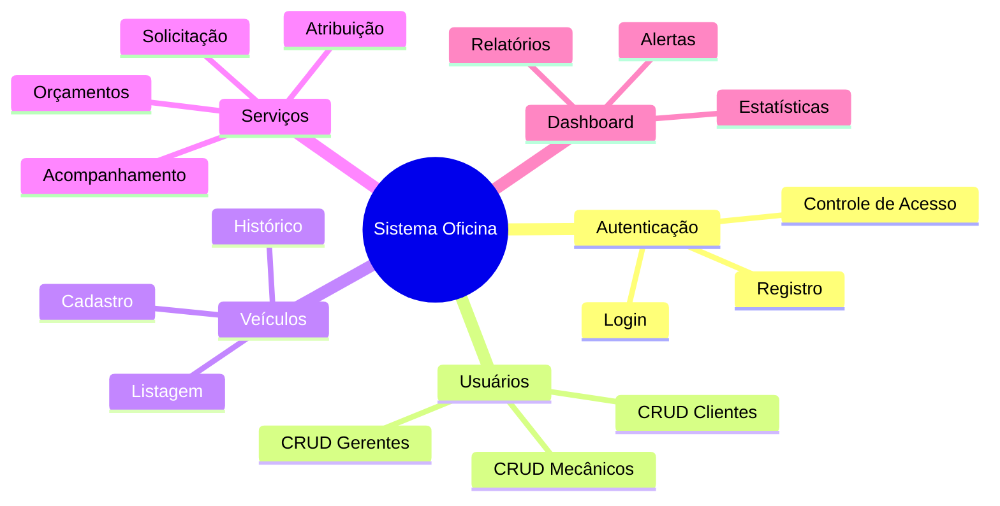
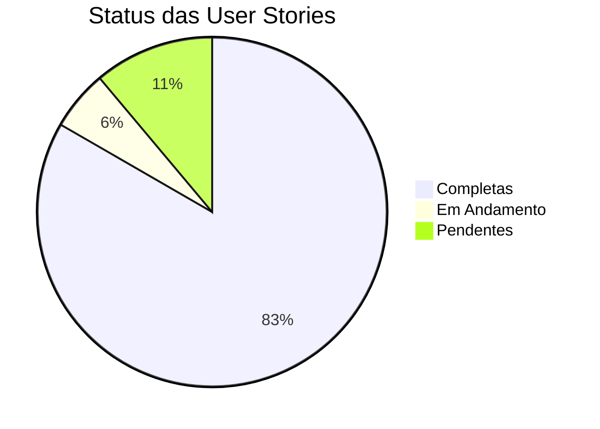
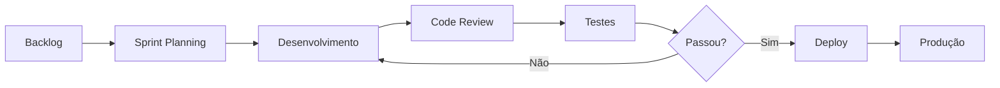
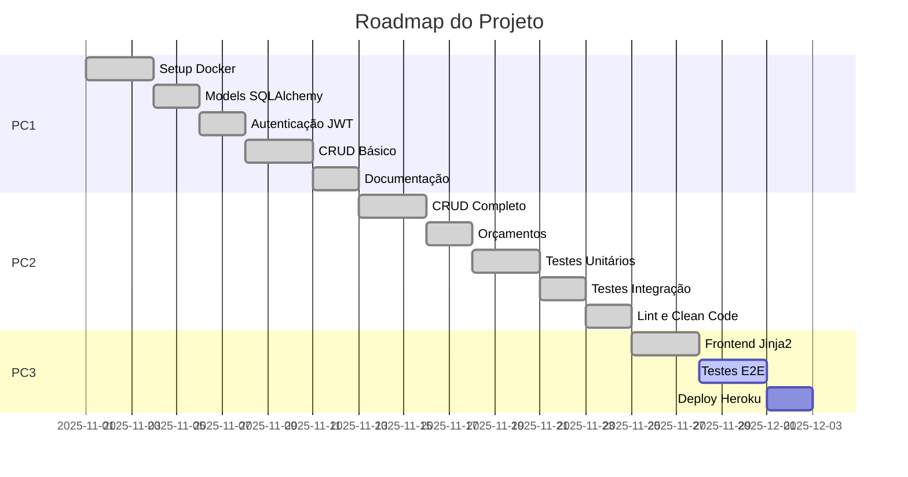

# Product Backlog - Sistema de Oficina Mecânica

## Visão Geral do Produto

Sistema web para gerenciamento de oficina mecânica que permite a clientes solicitar serviços para seus veículos, mecânicos gerenciarem suas tarefas e gerentes administrarem toda a operação.

---

## Épicos

---

## User Stories por Sprint

### Sprint 1 (PC1) - Fundação ✅ COMPLETO

#### US001 - Registro de Usuário
**Como** visitante  
**Quero** me cadastrar no sistema  
**Para** poder acessar as funcionalidades da oficina

**Critérios de Aceitação:**
- [x] Formulário com nome, email, senha e tipo de usuário
- [x] Validação de email único
- [x] Senha criptografada com bcrypt
- [x] Tipos: cliente, mecânico, gerente
- [x] Mensagem de confirmação após cadastro

**Pontos:** 5 | **Prioridade:** Alta

---

#### US002 - Login de Usuário
**Como** usuário cadastrado  
**Quero** fazer login no sistema  
**Para** acessar minhas funcionalidades

**Critérios de Aceitação:**
- [x] Login com email e senha
- [x] Geração de token JWT (1h expiração)
- [x] Redirecionamento para dashboard apropriado
- [x] Mensagem de erro para credenciais inválidas

**Pontos:** 3 | **Prioridade:** Alta

---

#### US003 - Gerenciamento de Usuários (Gerente)
**Como** gerente  
**Quero** gerenciar os usuários do sistema  
**Para** controlar acessos e permissões

**Critérios de Aceitação:**
- [x] Listar todos os usuários
- [x] Filtrar por tipo de usuário
- [x] Criar novos usuários
- [x] Editar dados de usuários
- [x] Remover usuários

**Pontos:** 8 | **Prioridade:** Alta

---

#### US004 - Cadastro de Veículo
**Como** cliente  
**Quero** cadastrar meus veículos  
**Para** poder solicitar serviços

**Critérios de Aceitação:**
- [x] Cadastro com placa, modelo, marca, ano, cor
- [x] Placa única no sistema
- [x] Veículo vinculado ao cliente
- [x] Cliente vê apenas seus veículos
- [x] Gerente vê todos os veículos

**Pontos:** 5 | **Prioridade:** Alta

---

#### US005 - Listagem de Veículos
**Como** usuário  
**Quero** ver a lista de veículos  
**Para** gerenciar ou solicitar serviços

**Critérios de Aceitação:**
- [x] Cliente vê seus veículos
- [x] Gerente vê todos os veículos
- [x] Exibir informações básicas (placa, modelo, marca)
- [x] Link para detalhes e serviços

**Pontos:** 3 | **Prioridade:** Média

---

#### US006 - Solicitação de Serviço
**Como** cliente  
**Quero** solicitar um serviço para meu veículo  
**Para** resolver problemas mecânicos

**Critérios de Aceitação:**
- [x] Selecionar veículo
- [x] Descrever problema
- [x] Status inicial: pendente/aguardando_orcamento
- [x] Confirmação de criação

**Pontos:** 5 | **Prioridade:** Alta

---

#### US007 - Dashboard Personalizado
**Como** usuário  
**Quero** ver um dashboard personalizado  
**Para** acompanhar informações relevantes

**Critérios de Aceitação:**
- [x] Cliente: veículos e serviços
- [x] Mecânico: serviços atribuídos
- [x] Gerente: estatísticas gerais
- [x] Dados em tempo real

**Pontos:** 8 | **Prioridade:** Média

---

### Sprint 2 (PC2) - Qualidade ✅ COMPLETO

#### US008 - Gerenciamento de Serviços (Gerente)
**Como** gerente  
**Quero** gerenciar todos os serviços  
**Para** controlar o fluxo de trabalho

**Critérios de Aceitação:**
- [x] Listar todos os serviços
- [x] Atribuir mecânico a serviço
- [x] Alterar status do serviço
- [x] Criar orçamentos

**Pontos:** 8 | **Prioridade:** Alta

---

#### US009 - Atualização de Status (Mecânico)
**Como** mecânico  
**Quero** atualizar o status dos meus serviços  
**Para** informar o andamento do trabalho

**Critérios de Aceitação:**
- [x] Ver serviços atribuídos
- [x] Alterar status (em_andamento, concluído)
- [x] Adicionar observações
- [x] Registrar data de conclusão

**Pontos:** 5 | **Prioridade:** Alta

---

#### US010 - Sistema de Orçamentos
**Como** gerente/mecânico  
**Quero** criar orçamentos para serviços  
**Para** informar valores ao cliente

**Critérios de Aceitação:**
- [x] Criar orçamento com descrição e valor
- [x] Múltiplos orçamentos por serviço
- [x] Valores de mão de obra e peças
- [x] Cálculo automático de total

**Pontos:** 5 | **Prioridade:** Alta

---

#### US011 - Testes Unitários
**Como** desenvolvedor  
**Quero** testes unitários automatizados  
**Para** garantir qualidade do código

**Critérios de Aceitação:**
- [x] Testes de autenticação
- [x] Testes de CRUD
- [x] Testes de permissões
- [x] Cobertura > 75%

**Pontos:** 8 | **Prioridade:** Alta

---

#### US012 - Testes Parametrizados
**Como** desenvolvedor  
**Quero** testes parametrizados  
**Para** cobrir múltiplos cenários

**Critérios de Aceitação:**
- [x] Testes com múltiplas entradas
- [x] Validações de campos
- [x] Cenários de erro
- [x] 50+ testes parametrizados

**Pontos:** 5 | **Prioridade:** Alta

---

#### US013 - Testes de Integração
**Como** desenvolvedor  
**Quero** testes de integração  
**Para** validar fluxos completos

**Critérios de Aceitação:**
- [x] Testes de API REST
- [x] Testes de banco de dados
- [x] Testes de autenticação
- [x] Cobertura > 79%

**Pontos:** 8 | **Prioridade:** Alta

---

### Sprint 3 (PC3) - Produção ⏳ EM ANDAMENTO

#### US014 - Frontend Completo
**Como** usuário  
**Quero** uma interface web completa  
**Para** usar o sistema de forma intuitiva

**Critérios de Aceitação:**
- [x] Templates Jinja2 responsivos
- [x] Design profissional (tema automotivo)
- [x] Modo escuro
- [x] Navegação intuitiva
- [x] Formulários funcionais

**Pontos:** 13 | **Prioridade:** Alta

---

#### US015 - Solicitar Orçamento (Cliente)
**Como** cliente  
**Quero** solicitar orçamento para meu veículo  
**Para** saber o custo do serviço

**Critérios de Aceitação:**
- [x] Formulário de solicitação
- [x] Seleção de veículo
- [x] Descrição do problema
- [x] Status automático: aguardando_orcamento

**Pontos:** 5 | **Prioridade:** Alta

---

#### US016 - Testes E2E com Selenium
**Como** desenvolvedor  
**Quero** testes automatizados de interface  
**Para** validar fluxos do usuário

**Critérios de Aceitação:**
- [ ] Teste de login
- [ ] Teste de cadastro de veículo
- [ ] Teste de solicitação de serviço
- [ ] Teste de dashboard
- [ ] 3-5 fluxos principais

**Pontos:** 8 | **Prioridade:** Alta

---

#### US017 - Deploy em Produção
**Como** usuário  
**Quero** acessar o sistema online  
**Para** usar de qualquer lugar

**Critérios de Aceitação:**
- [ ] Deploy em Heroku/Render/Railway
- [ ] Banco de dados PostgreSQL
- [ ] HTTPS configurado
- [ ] Variáveis de ambiente seguras

**Pontos:** 5 | **Prioridade:** Alta

---

## Métricas do Projeto

| Métrica | Valor |
|---------|-------|
| Total de User Stories | 17 |
| Completas | 15 (88%) |
| Em Andamento | 1 (6%) |
| Pendentes | 2 (12%) |
| Total de Testes | 99 |
| Cobertura de Código | 79% |
| Erros de Lint | 0 |

---

## Fluxo de Desenvolvimento

---

## Roadmap

