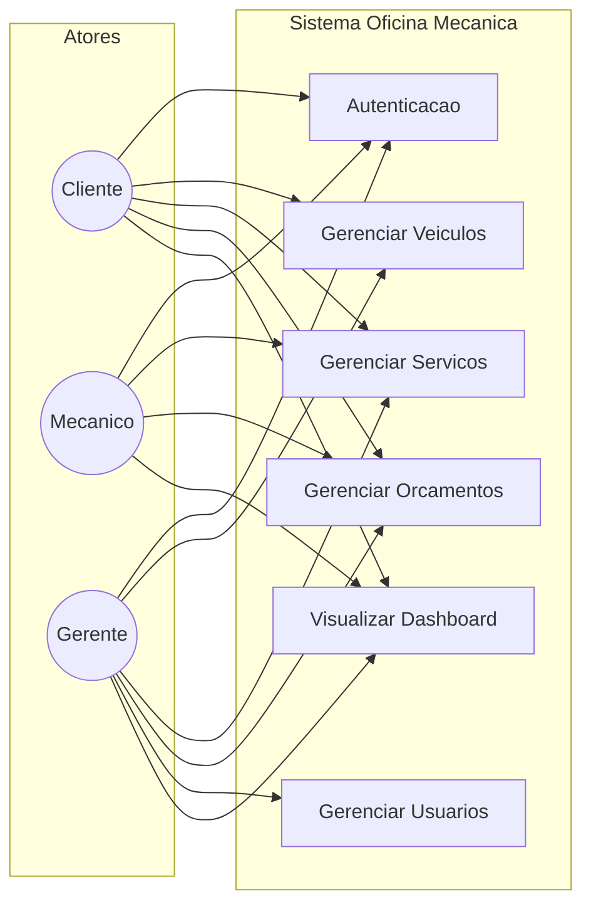

# Casos de Uso - Sistema Oficina Mecânica

## Atores

| Ator | Descrição |
|------|-----------|
| **Cliente** | Cadastra veículos, solicita serviços, aprova orçamentos |
| **Mecânico** | Executa serviços, cria orçamentos, atualiza status |
| **Gerente** | Gerencia usuários, atribui mecânicos, controla operações |

## Diagrama de Casos de Uso

## Permissões por Ator (RBAC)

| Recurso | Cliente | Mecânico | Gerente |
|---------|:-------:|:--------:|:-------:|
| Veículos próprios | CRUD | R | CRUD |
| Serviços próprios | CR | RU | CRUD |
| Orçamentos | R | CRU | CRUD |
| Usuários | - | - | CRUD |
| Dashboard | Próprio | Próprio | Completo |

**Legenda:** C=Create, R=Read, U=Update, D=Delete

## Fluxo Principal do Sistema

1. **Cliente** cadastra veículo e solicita serviço
2. **Mecânico** cria orçamento para o serviço
3. **Cliente** aprova ou rejeita orçamento
4. **Gerente** atribui mecânico ao serviço aprovado
5. **Mecânico** executa e conclui o serviço
6. **Cliente** visualiza resultado no dashboard
