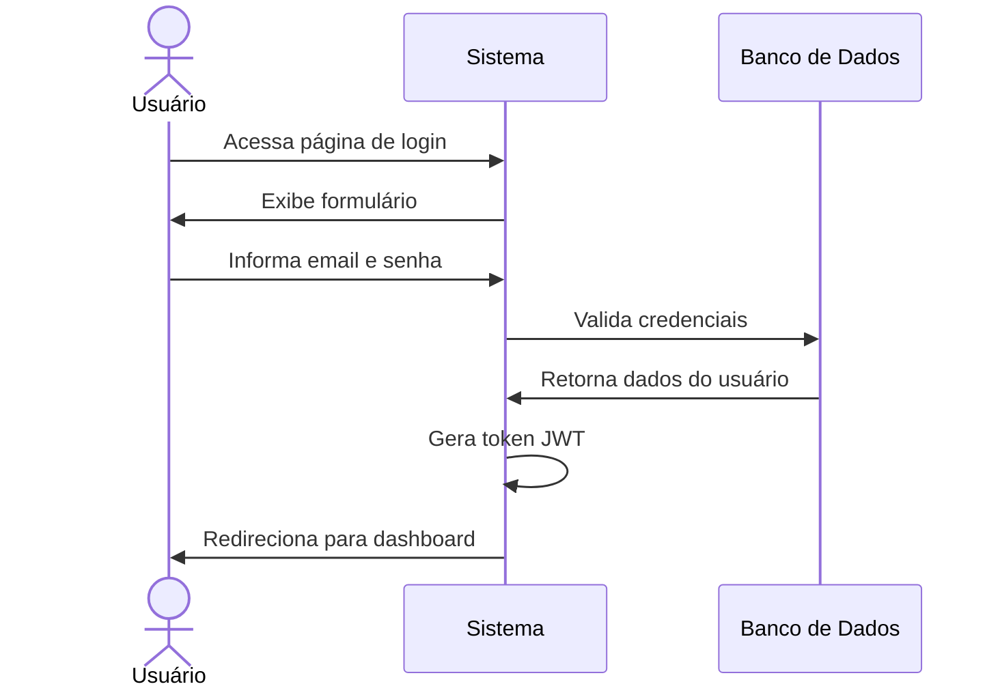
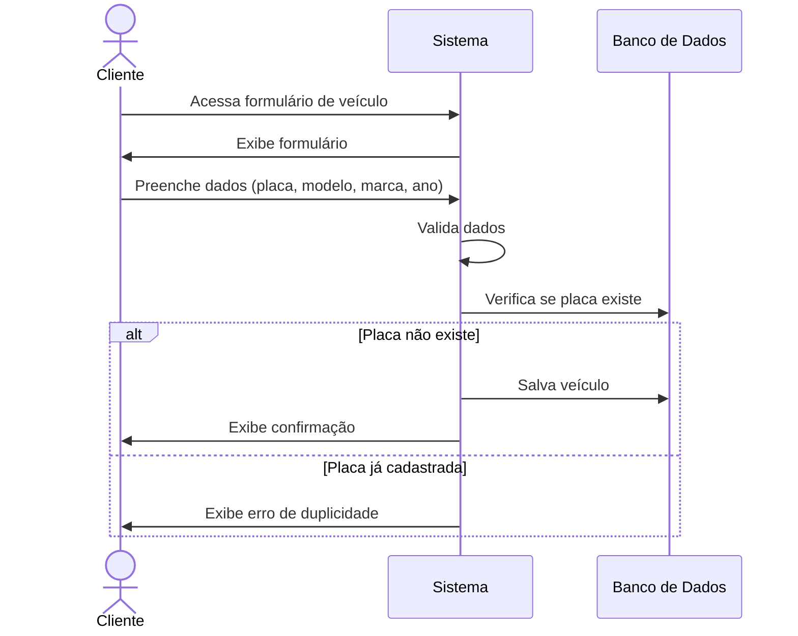
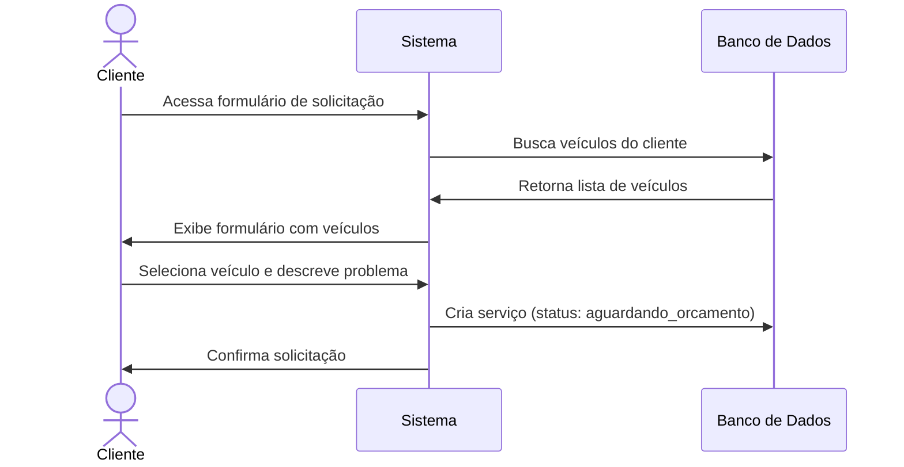
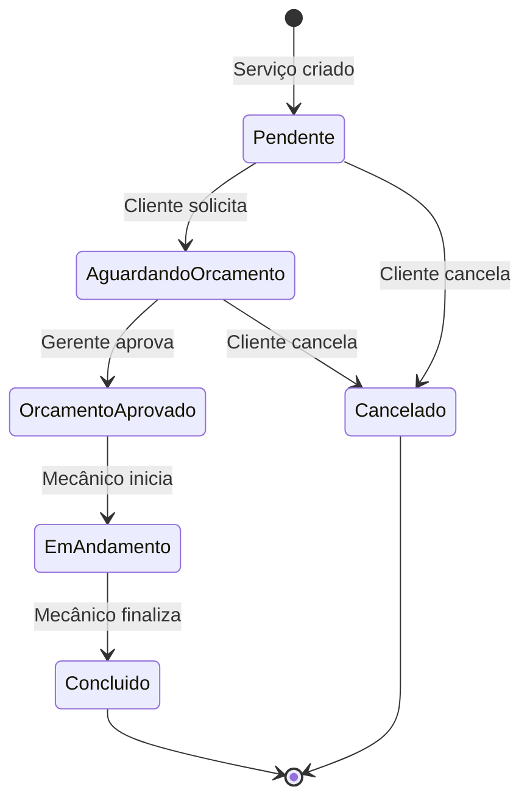
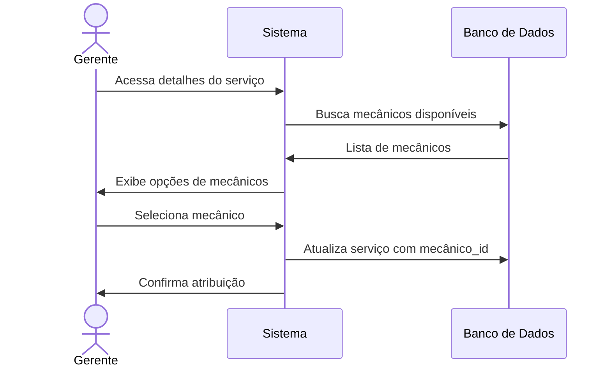
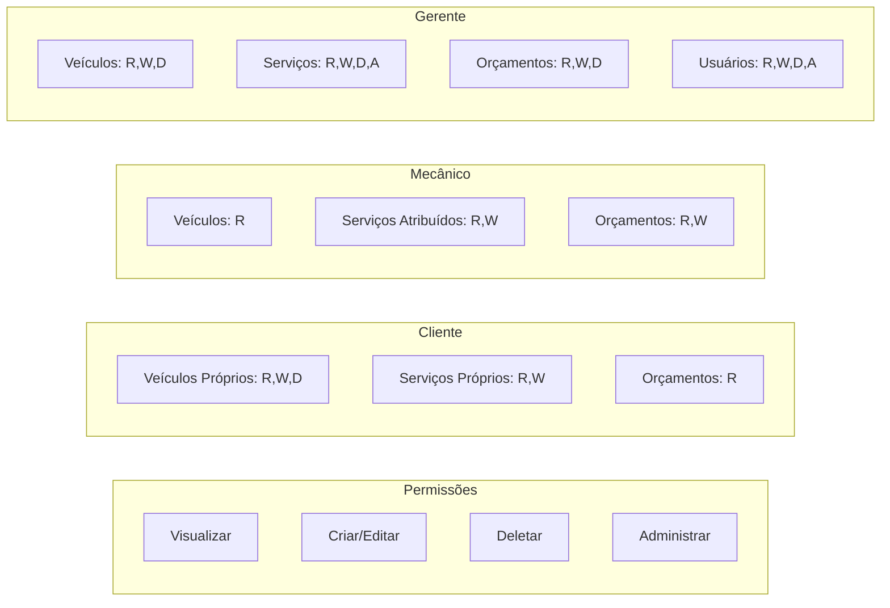
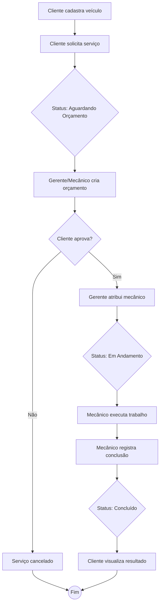

# Diagrama de Casos de Uso - Sistema Oficina Mecânica

## Visão Geral

Sistema de gerenciamento de oficina mecânica com três tipos de atores principais.

---

## Atores do Sistema

| Ator | Descrição | Responsabilidades |
|------|-----------|-------------------|
| **Cliente** | Proprietário de veículos | Cadastrar veículos, solicitar serviços, acompanhar status |
| **Mecânico** | Profissional técnico | Executar serviços, atualizar status, criar orçamentos |
| **Gerente** | Administrador | Gerenciar usuários, atribuir serviços, controlar operações |

---

## Diagrama de Casos de Uso

```mermaid
flowchart TB
    subgraph Atores
        C((Cliente))
        M((Mecânico))
        G((Gerente))
    end

    subgraph Sistema["Sistema Oficina Mecânica"]
        subgraph Auth["Autenticação"]
            UC01[UC01: Fazer Login]
            UC02[UC02: Registrar-se]
            UC03[UC03: Fazer Logout]
        end

        subgraph Veiculos["Gestão de Veículos"]
            UC04[UC04: Cadastrar Veículo]
            UC05[UC05: Listar Veículos]
            UC06[UC06: Editar Veículo]
            UC07[UC07: Excluir Veículo]
        end

        subgraph Servicos["Gestão de Serviços"]
            UC08[UC08: Solicitar Serviço]
            UC09[UC09: Listar Serviços]
            UC10[UC10: Ver Detalhes Serviço]
            UC11[UC11: Atualizar Status]
            UC12[UC12: Atribuir Mecânico]
        end

        subgraph Orcamentos["Gestão de Orçamentos"]
            UC13[UC13: Criar Orçamento]
            UC14[UC14: Visualizar Orçamento]
            UC15[UC15: Aprovar Orçamento]
        end

        subgraph Usuarios["Gestão de Usuários"]
            UC16[UC16: Listar Usuários]
            UC17[UC17: Criar Usuário]
            UC18[UC18: Editar Usuário]
            UC19[UC19: Excluir Usuário]
        end

        subgraph Dashboard["Dashboards"]
            UC20[UC20: Ver Dashboard Cliente]
            UC21[UC21: Ver Dashboard Mecânico]
            UC22[UC22: Ver Dashboard Gerente]
        end
    end

    %% Cliente
    C --> UC01
    C --> UC02
    C --> UC03
    C --> UC04
    C --> UC05
    C --> UC06
    C --> UC07
    C --> UC08
    C --> UC09
    C --> UC10
    C --> UC14
    C --> UC20

    %% Mecânico
    M --> UC01
    M --> UC03
    M --> UC09
    M --> UC10
    M --> UC11
    M --> UC13
    M --> UC14
    M --> UC21

    %% Gerente
    G --> UC01
    G --> UC03
    G --> UC05
    G --> UC09
    G --> UC10
    G --> UC11
    G --> UC12
    G --> UC13
    G --> UC14
    G --> UC15
    G --> UC16
    G --> UC17
    G --> UC18
    G --> UC19
    G --> UC22
```

---

## Especificações de Casos de Uso

### UC01 - Fazer Login

| Campo | Descrição |
|-------|-----------|
| **Ator** | Cliente, Mecânico, Gerente |
| **Pré-condição** | Usuário cadastrado no sistema |
| **Pós-condição** | Usuário autenticado com sessão ativa |

**Fluxo Principal:**

**Fluxo Alternativo:**
- **FA01**: Credenciais inválidas → Exibe mensagem de erro

---

### UC04 - Cadastrar Veículo

| Campo | Descrição |
|-------|-----------|
| **Ator** | Cliente |
| **Pré-condição** | Usuário autenticado como cliente |
| **Pós-condição** | Veículo registrado no sistema |

**Fluxo Principal:**

---

### UC08 - Solicitar Serviço

| Campo | Descrição |
|-------|-----------|
| **Ator** | Cliente |
| **Pré-condição** | Cliente possui veículo cadastrado |
| **Pós-condição** | Serviço criado com status "aguardando_orcamento" |

**Fluxo Principal:**

---

### UC11 - Atualizar Status do Serviço

| Campo | Descrição |
|-------|-----------|
| **Ator** | Mecânico, Gerente |
| **Pré-condição** | Serviço existe e está atribuído |
| **Pós-condição** | Status do serviço atualizado |

**Fluxo de Estados:**

---

### UC12 - Atribuir Mecânico

| Campo | Descrição |
|-------|-----------|
| **Ator** | Gerente |
| **Pré-condição** | Serviço pendente, mecânico disponível |
| **Pós-condição** | Mecânico atribuído ao serviço |

**Fluxo Principal:**

---

## Matriz de Permissões (RBAC)

| Recurso | Cliente | Mecânico | Gerente |
|---------|:-------:|:--------:|:-------:|
| Veículos (próprios) | CRUD | R | CRUD |
| Veículos (todos) | - | R | CRUD |
| Serviços (próprios) | CR | - | - |
| Serviços (atribuídos) | - | RU | - |
| Serviços (todos) | - | - | CRUD |
| Orçamentos | R | CRU | CRUD |
| Usuários | - | - | CRUD |
| Dashboard | Próprio | Próprio | Completo |

**Legenda:** C=Create, R=Read, U=Update, D=Delete

---

## Workflow Completo do Serviço

