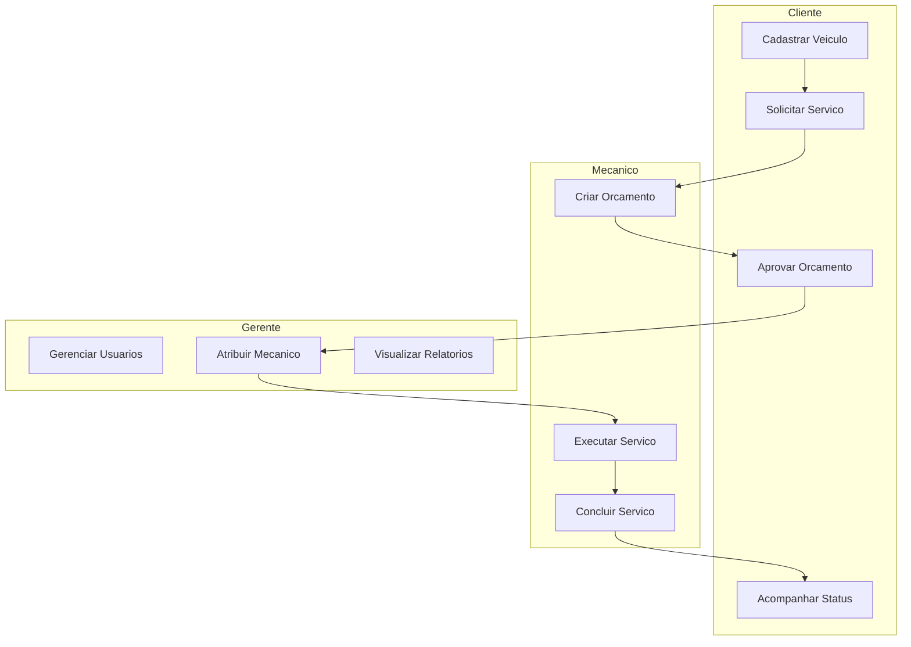

# Casos de Uso - Sistema Oficina Mecânica

## Atores

| Ator | Descrição |
|------|-----------|
| **Cliente** | Cadastra veículos, solicita serviços, aprova orçamentos |
| **Mecânico** | Executa serviços, cria orçamentos, atualiza status |
| **Gerente** | Gerencia usuários, atribui mecânicos, controla operações |

## Diagrama de Casos de Uso

## Permissões (RBAC)

| Recurso | Cliente | Mecânico | Gerente |
|---------|:-------:|:--------:|:-------:|
| Veículos | CRUD | R | CRUD |
| Serviços | CR | RU | CRUD |
| Orçamentos | R | CRU | CRUD |
| Usuários | - | - | CRUD |

**Legenda:** C=Create, R=Read, U=Update, D=Delete

## Fluxo Principal

1. **Cliente** cadastra veículo → solicita serviço
2. **Mecânico** cria orçamento → aguarda aprovação
3. **Cliente** aprova orçamento
4. **Gerente** atribui mecânico
5. **Mecânico** executa → conclui serviço
6. **Cliente** acompanha resultado
