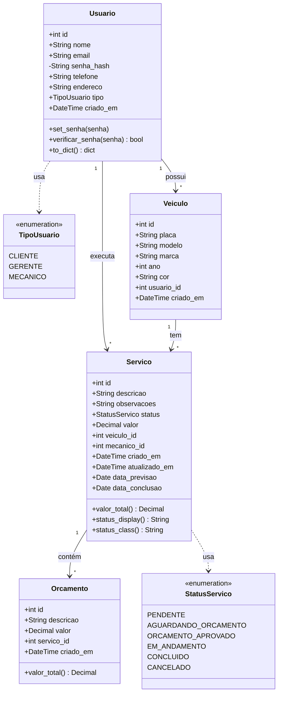

# Diagrama de Classes

Este documento apresenta a estrutura de classes do sistema de gestão de oficina mecânica.

## Diagrama UML

## Descrição das Classes

| Classe | Descrição |
|--------|-----------|
| **Usuario** | Representa clientes, gerentes e mecânicos do sistema. Possui métodos para gerenciar senha e converter dados |
| **Veiculo** | Armazena informações dos veículos cadastrados. Cada veículo pertence a um usuário |
| **Servico** | Registro de serviços realizados na oficina. Vincula veículo e mecânico responsável |
| **Orcamento** | Itens do orçamento de um serviço. Pode haver vários itens por serviço |

## Enumerações

| Enum | Valores | Uso |
|------|---------|-----|
| **TipoUsuario** | CLIENTE, GERENTE, MECANICO | Define o perfil de acesso do usuário |
| **StatusServico** | PENDENTE, AGUARDANDO_ORCAMENTO, ORCAMENTO_APROVADO, EM_ANDAMENTO, CONCLUIDO, CANCELADO | Ciclo de vida de um serviço |

## Relacionamentos

| Origem | Destino | Cardinalidade | Descrição |
|--------|---------|---------------|-----------|
| Usuario | Veiculo | 1 : N | Um cliente pode ter vários veículos |
| Usuario | Servico | 1 : N | Um mecânico pode executar vários serviços |
| Veiculo | Servico | 1 : N | Um veículo pode ter vários serviços |
| Servico | Orcamento | 1 : N | Um serviço pode ter vários itens de orçamento |
