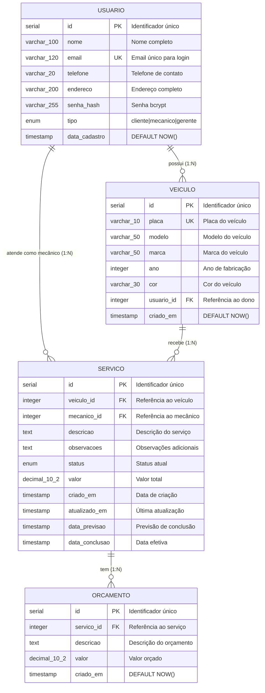
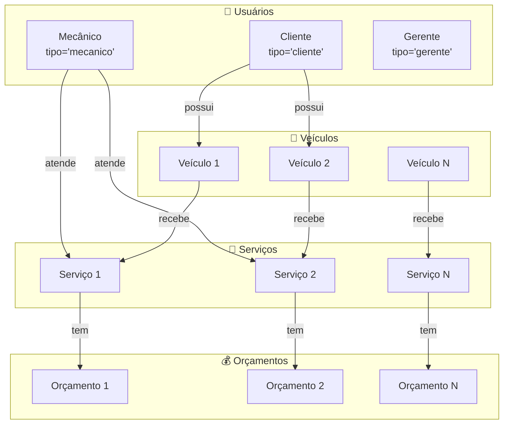
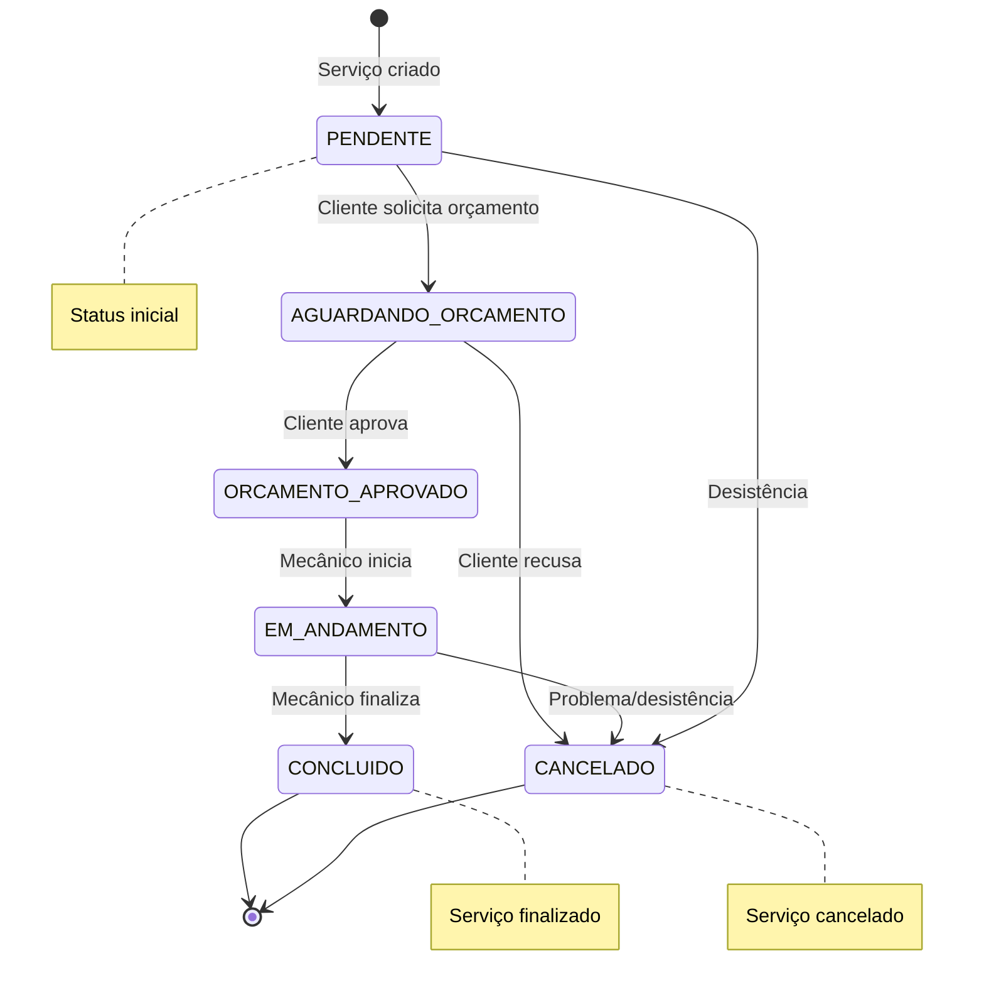

# Modelo Entidade-Relacionamento Físico - Sistema Oficina Mecânica

## Visão Geral

Este documento descreve o modelo físico do banco de dados PostgreSQL 15 do sistema de gerenciamento de oficina mecânica.

| Aspecto | Descrição |
|---------|-----------|
| **SGBD** | PostgreSQL 15 |
| **Normalização** | 3ª Forma Normal (3NF) |
| **Tabelas** | 4 (Usuario, Veiculo, Servico, Orcamento) |
| **ORM** | SQLAlchemy 2.0 |

---

## Diagrama ER Completo



---

## Diagrama de Relacionamentos



---

## Fluxo de Estados do Serviço



## Estrutura Detalhada das Tabelas

### Tabela: `usuario`
**Descrição:** Armazena informações dos usuários do sistema (clientes, mecânicos e gerentes).

| Coluna | Tipo | Constraints | Descrição |
|--------|------|-------------|-----------|
| id | SERIAL | PRIMARY KEY | Identificador único |
| nome | VARCHAR(100) | NOT NULL | Nome completo do usuário |
| email | VARCHAR(120) | UNIQUE, NOT NULL | Email único para login |
| telefone | VARCHAR(20) | NOT NULL | Telefone de contato |
| senha_hash | VARCHAR(200) | NOT NULL | Senha criptografada com bcrypt |
| tipo_usuario | ENUM | NOT NULL | 'cliente', 'mecanico' ou 'gerente' |
| data_cadastro | TIMESTAMP | DEFAULT NOW() | Data de registro no sistema |

**Índices:**
- `idx_usuario_email` (UNIQUE) - email
- `idx_usuario_tipo` - tipo_usuario

**Constraints:**
- `ck_tipo_usuario` - CHECK (tipo_usuario IN ('cliente', 'mecanico', 'gerente'))

---

### Tabela: `veiculo`
**Descrição:** Armazena informações dos veículos dos clientes.

| Coluna | Tipo | Constraints | Descrição |
|--------|------|-------------|-----------|
| id | SERIAL | PRIMARY KEY | Identificador único |
| marca | VARCHAR(50) | NOT NULL | Marca do veículo |
| modelo | VARCHAR(50) | NOT NULL | Modelo do veículo |
| ano | INTEGER | NOT NULL | Ano de fabricação |
| placa | VARCHAR(10) | UNIQUE, NOT NULL | Placa do veículo |
| cor | VARCHAR(30) | NOT NULL | Cor do veículo |
| dono_id | INTEGER | FOREIGN KEY, NOT NULL | Referência ao proprietário |
| data_cadastro | TIMESTAMP | DEFAULT NOW() | Data de cadastro |

**Índices:**
- `idx_veiculo_placa` (UNIQUE) - placa
- `idx_veiculo_dono` - dono_id

**Constraints:**
- `fk_veiculo_dono` - FOREIGN KEY (dono_id) REFERENCES usuario(id)
- `ck_veiculo_ano` - CHECK (ano >= 1900 AND ano <= 2030)

---

### Tabela: `servico`
**Descrição:** Armazena informações dos serviços realizados nos veículos.

| Coluna | Tipo | Constraints | Descrição |
|--------|------|-------------|-----------|
| id | SERIAL | PRIMARY KEY | Identificador único |
| veiculo_id | INTEGER | FOREIGN KEY, NOT NULL | Referência ao veículo |
| mecanico_responsavel_id | INTEGER | FOREIGN KEY | Referência ao mecânico |
| descricao | TEXT | NOT NULL | Descrição do problema/serviço |
| observacoes | TEXT | | Observações adicionais |
| status | ENUM | NOT NULL | Status atual do serviço |
| valor_mao_obra | DECIMAL(10,2) | | Valor da mão de obra |
| valor_pecas | DECIMAL(10,2) | | Valor das peças |
| valor_total | DECIMAL(10,2) | | Valor total do serviço |
| data_entrada | DATE | NOT NULL | Data de entrada do veículo |
| data_previsao | DATE | | Data prevista de conclusão |
| data_conclusao | DATE | | Data efetiva de conclusão |

**Índices:**
- `idx_servico_veiculo` - veiculo_id
- `idx_servico_mecanico` - mecanico_responsavel_id
- `idx_servico_status` - status
- `idx_servico_data_entrada` - data_entrada

**Constraints:**
- `fk_servico_veiculo` - FOREIGN KEY (veiculo_id) REFERENCES veiculo(id)
- `fk_servico_mecanico` - FOREIGN KEY (mecanico_responsavel_id) REFERENCES usuario(id)
- `ck_servico_status` - CHECK (status IN ('aguardando_orcamento', 'orcamento_aprovado', 'em_andamento', 'concluido', 'cancelado'))
- `ck_servico_valores` - CHECK (valor_mao_obra >= 0 AND valor_pecas >= 0 AND valor_total >= 0)

---

### Tabela: `orcamento`
**Descrição:** Armazena os orçamentos criados para os serviços.

| Coluna | Tipo | Constraints | Descrição |
|--------|------|-------------|-----------|
| id | SERIAL | PRIMARY KEY | Identificador único |
| servico_id | INTEGER | FOREIGN KEY, NOT NULL | Referência ao serviço |
| valor_mao_obra | DECIMAL(10,2) | NOT NULL | Valor da mão de obra orçada |
| valor_pecas | DECIMAL(10,2) | NOT NULL | Valor das peças orçadas |
| valor_total | DECIMAL(10,2) | NOT NULL | Valor total orçado |
| aprovado | BOOLEAN | DEFAULT FALSE | Se o orçamento foi aprovado |
| data_orcamento | TIMESTAMP | DEFAULT NOW() | Data de criação do orçamento |

**Índices:**
- `idx_orcamento_servico` - servico_id
- `idx_orcamento_aprovado` - aprovado

**Constraints:**
- `fk_orcamento_servico` - FOREIGN KEY (servico_id) REFERENCES servico(id) ON DELETE CASCADE
- `ck_orcamento_valores` - CHECK (valor_mao_obra >= 0 AND valor_pecas >= 0)
- `ck_orcamento_total` - CHECK (valor_total = valor_mao_obra + valor_pecas)

---

## Relacionamentos

### 1:N - Usuario → Veiculo
- **Cardinalidade:** Um usuário pode possuir vários veículos
- **Chave Estrangeira:** veiculo.dono_id → usuario.id
- **Regra de Integridade:** ON DELETE RESTRICT (não permite deletar usuário com veículos)

### 1:N - Usuario → Servico
- **Cardinalidade:** Um mecânico pode realizar vários serviços
- **Chave Estrangeira:** servico.mecanico_responsavel_id → usuario.id
- **Regra de Integridade:** ON DELETE SET NULL (permite remover mecânico)

### 1:N - Veiculo → Servico
- **Cardinalidade:** Um veículo pode ter vários serviços
- **Chave Estrangeira:** servico.veiculo_id → veiculo.id
- **Regra de Integridade:** ON DELETE RESTRICT (não permite deletar veículo com serviços)

### 1:N - Servico → Orcamento
- **Cardinalidade:** Um serviço pode ter vários orçamentos
- **Chave Estrangeira:** orcamento.servico_id → servico.id
- **Regra de Integridade:** ON DELETE CASCADE (deleta orçamentos ao deletar serviço)

---

## Enums PostgreSQL

### tipo_usuario
```sql
CREATE TYPE tipo_usuario_enum AS ENUM ('cliente', 'mecanico', 'gerente');
```

### status_servico
```sql
CREATE TYPE status_servico_enum AS ENUM (
    'aguardando_orcamento',
    'orcamento_aprovado',
    'em_andamento',
    'concluido',
    'cancelado'
);
```

---

## Scripts de Criação

### Criar Banco de Dados
```sql
CREATE DATABASE mecanica_db
    WITH 
    OWNER = postgres
    ENCODING = 'UTF8'
    LC_COLLATE = 'pt_BR.UTF-8'
    LC_CTYPE = 'pt_BR.UTF-8'
    TEMPLATE = template0;
```

### Conectar ao Banco
```bash
psql -U postgres -d mecanica_db
```

### Verificar Estrutura
```sql
-- Listar tabelas
\dt

-- Descrever tabela
\d usuario
\d veiculo
\d servico
\d orcamento

-- Ver índices
SELECT * FROM pg_indexes WHERE tablename = 'servico';

-- Ver constraints
SELECT conname, contype FROM pg_constraint WHERE conrelid = 'servico'::regclass;
```

---

## Otimizações Implementadas

1. **Índices em Chaves Estrangeiras:** Todos os campos FK possuem índices para melhorar performance de JOINs
2. **Índices em Campos de Busca:** Email e placa possuem índices UNIQUE
3. **Índices Compostos:** status + data_entrada para dashboards
4. **Constraints de Validação:** Garantem integridade dos dados em nível de banco
5. **Triggers:** Podem ser adicionados para auditoria (não implementado na v1.0)

---

## Normalização

O banco de dados está na **3ª Forma Normal (3NF)**:
- ✅ 1NF: Todos os atributos são atômicos
- ✅ 2NF: Não há dependências parciais
- ✅ 3NF: Não há dependências transitivas

**Exemplo de normalização aplicada:**
- Valores são calculados (valor_total = valor_mao_obra + valor_pecas) mas armazenados para histórico
- Status é enum em vez de string livre
- Tipos de usuário são enum em vez de tabela separada (decisão de projeto para simplicidade)

---

## Estatísticas e Tamanho Esperado

### Estimativa de Crescimento (por ano)
- Usuários: ~500 registros
- Veículos: ~1000 registros
- Serviços: ~5000 registros
- Orçamentos: ~8000 registros

### Tamanho Estimado
- usuario: ~100 KB
- veiculo: ~200 KB
- servico: ~1 MB
- orcamento: ~1.5 MB
**Total: ~3 MB/ano**

---

## Backup e Manutenção

### Backup Recomendado
```bash
# Backup completo
pg_dump -U postgres -d mecanica_db -F c -f backup_mecanica_$(date +%Y%m%d).dump

# Restaurar
pg_restore -U postgres -d mecanica_db backup_mecanica_20250101.dump
```

### Manutenção Periódica
```sql
-- Atualizar estatísticas
ANALYZE;

-- Reindexar tabelas
REINDEX TABLE servico;

-- Limpar dados antigos (vacuum)
VACUUM ANALYZE;
```
