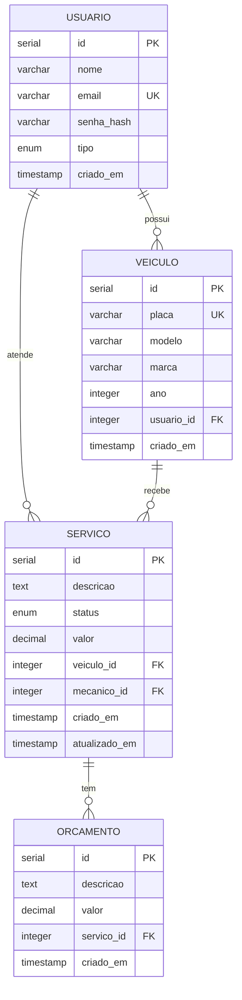

# Modelo ER - Sistema Oficina Mecânica

## Visão Geral

| Aspecto | Descrição |
|---------|-----------|
| **SGBD** | PostgreSQL 15 |
| **ORM** | SQLAlchemy 2.0 |
| **Normalização** | 3ª Forma Normal (3NF) |
| **Tabelas** | 4 (usuarios, veiculos, servicos, orcamentos) |

## Diagrama Entidade-Relacionamento



## Estrutura das Tabelas

### usuarios
| Coluna | Tipo | Constraints |
|--------|------|-------------|
| id | SERIAL | PRIMARY KEY |
| nome | VARCHAR(100) | NOT NULL |
| email | VARCHAR(120) | UNIQUE, NOT NULL |
| senha_hash | VARCHAR(255) | NOT NULL |
| tipo | ENUM | NOT NULL (cliente, mecanico, gerente) |
| criado_em | TIMESTAMP | DEFAULT NOW() |

### veiculos
| Coluna | Tipo | Constraints |
|--------|------|-------------|
| id | SERIAL | PRIMARY KEY |
| placa | VARCHAR(10) | UNIQUE, NOT NULL |
| modelo | VARCHAR(50) | NOT NULL |
| marca | VARCHAR(50) | NOT NULL |
| ano | INTEGER | NOT NULL |
| usuario_id | INTEGER | FOREIGN KEY → usuarios(id) |
| criado_em | TIMESTAMP | DEFAULT NOW() |

### servicos
| Coluna | Tipo | Constraints |
|--------|------|-------------|
| id | SERIAL | PRIMARY KEY |
| descricao | TEXT | NOT NULL |
| status | ENUM | NOT NULL |
| valor | DECIMAL(10,2) | NULL |
| veiculo_id | INTEGER | FOREIGN KEY → veiculos(id) |
| mecanico_id | INTEGER | FOREIGN KEY → usuarios(id) |
| criado_em | TIMESTAMP | DEFAULT NOW() |
| atualizado_em | TIMESTAMP | DEFAULT NOW() |

### orcamentos
| Coluna | Tipo | Constraints |
|--------|------|-------------|
| id | SERIAL | PRIMARY KEY |
| descricao | TEXT | NULL |
| valor | DECIMAL(10,2) | NOT NULL |
| servico_id | INTEGER | FOREIGN KEY → servicos(id) |
| criado_em | TIMESTAMP | DEFAULT NOW() |

## Enums

```sql
CREATE TYPE tipo_usuario AS ENUM ('cliente', 'mecanico', 'gerente');
CREATE TYPE status_servico AS ENUM ('pendente', 'aguardando_orcamento', 'orcamento_aprovado', 'em_andamento', 'concluido', 'cancelado');
```

## Relacionamentos

| Relação | Cardinalidade | FK |
|---------|---------------|-----|
| Usuario → Veiculo | 1:N | veiculos.usuario_id |
| Usuario → Servico | 1:N | servicos.mecanico_id |
| Veiculo → Servico | 1:N | servicos.veiculo_id |
| Servico → Orcamento | 1:N | orcamentos.servico_id |
